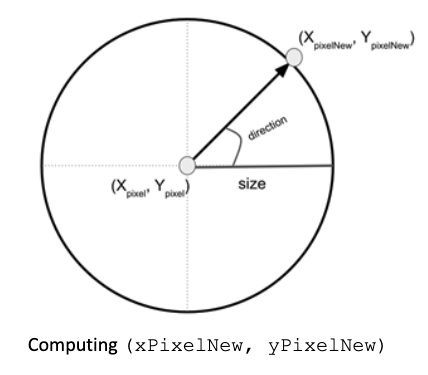
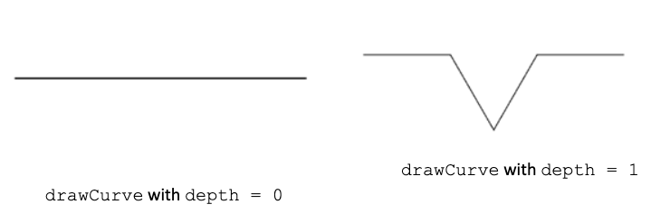
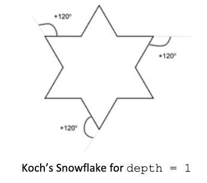

# Introduction  

Recursion is beautiful... To prove that, in this activity you will write an implementation for the Koch’s snowflake curve.  Read about this curve from the Wikipedia article available [here](https://en.wikipedia.org/wiki/Koch_snowflake).  Complete the implementation of the KockSnowflake class following the instructions below. Get the initial code from our GitHub’s repository.  

# Constructor 

The KochSnowflake's constructor accepts the starting point of the drawing as (xPixel, yPixel), a value for the depth, a size, and a color (object).  Use parameters(xPixel, yPixel) to initialize the correspondent instance variables.  Make sure these coordinate values are non-negative as they are defined in a graphical coordinate system.  Parameter depth should be greater than or equal zero; parameter size should be at least 10; finally, parameter direction defines an angle in degrees and it should be set initially to zero degrees.  

# Helper Methods 

The first helper method you should implement is **drawLine**. This method draws a line from (xPixel, yPixel) to (xPixelNew, yPixelNew), a new coordinate defined as:  

```
xPixelNew = xPixel + cosine(direction) ⨉ size 
yPixelNew = yPixel + sine(direction) ⨉ size 
```
 

**VERY IMPORTANT**:  make sure you convert direction from degrees to radians; hint: use the Math.toRadians function.  

Use **drawLine** from Java’s Graphics object to actually draw the line once you have computed the coordinates of the end point.  



Don’t forget to assign (xPixelNew, yPixelNew)to (xPixel, yPixel)once you are done drawing the line.  

The rotate method is straightforward: just add the degrees parameter to direction. There is no need to worry about direction becoming negative or greater than 360 degrees.  

# Koch’s Curve 

The **drawCurve** method implements the Koch’s curve.  It takes a Graphic’s object and a depth.  The **drawCurve** method is recursive: the base-case happens when the depth is equal to zero, resulting in **drawCurve** drawing a line using drawLine. If depth is greater than zero, **drawCurve** recursively calls itself FOUR times, each time using depth - 1 as the depth and rotating the direction using the pattern:  

* no rotation; 
* rotate clockwise 60o 
* rotate anti-clockwise 120o 
* rotate clockwise 60o 

Below are the results of calling **drawCurve** with depth = 0 and depth = 1.  



To help you understand how **drawCurve** with depth = 1 is drawn, study the picture below that shows the effect of rotating direction between calls to **drawCurve**.  


Below are the results of calling **drawCurve** with depth = 2, 3, and 4.  


# Koch’s Snowflake 

You get Koch’s snowflake simply by calling **drawCurve** three times, making 120 degrees rotation between calls.  The figure below explains the process when calling **drawSnowflake** using depth = 1.  

