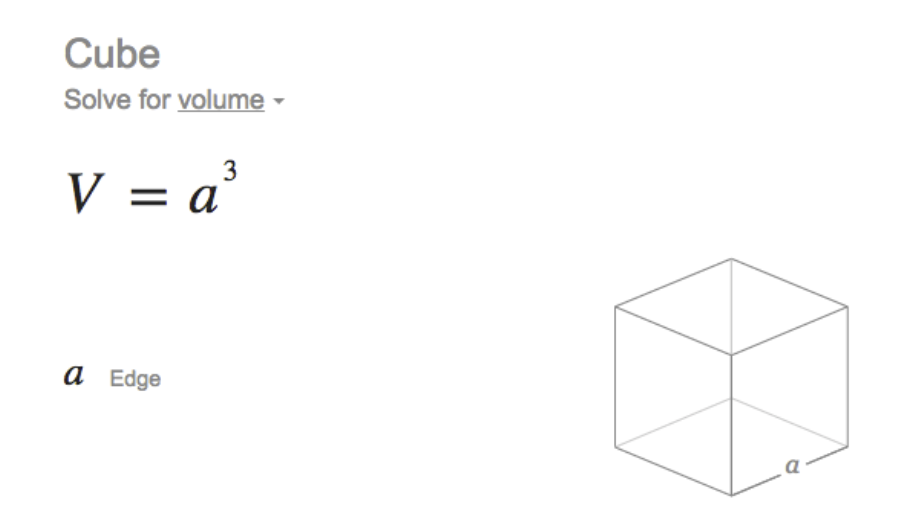
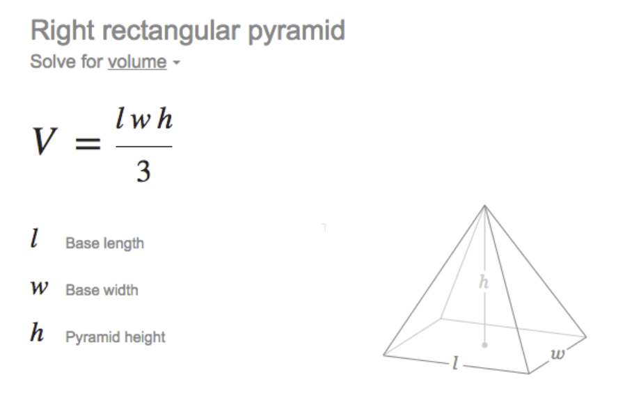
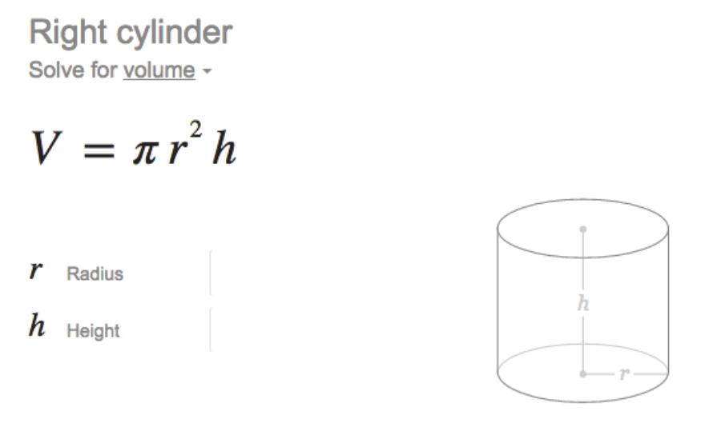

# Introduction 

In this activity you will create unit tests for specialized solid classes: Cube, Pyramid, and Cylinder. You will also generate documentation for the classes that you will implement. 

# Solid

The **Solid** class is an abstract class that defines a method to compute the volume of a solid. 

# Cube

The **Cube** class extends **Solid** and overrides the volume method according to the formula below. 

Implement 2 constructors for the **Cube** class: one that takes the side of the cube (if the informed value is invalid, then it should default to Solid.DEFAULT_MEASURE); and another that sets its side to Solid.DEFAULT_MEASURE automatically. 

Make sure that your implementation passes all of the tests defined in **CubeTest**. When you are done, document your class using JavaDoc's format. 

# Pyramid

Begin by writing **PyramidTest** first. When you are satisfied with your tests, write the **Pyramid** class implementation, similarly to what was done in **Cube**. For example, have the measures default to Solid.DEFAULT_MEASURE if the informed value is invalid. Also, write a constructor that creates a **Pyramid** using Solid.DEFAULT_MEASURE for length, width, and height. 

# Cylinder

Use a similar approach to implement the **CylinderTest** and **Cylinder** classes. 

