# Instructions

In this assignment you are asked to implement a linked list reverse method with a caveat: the reverse must be done "in-place". In other words, your solution must NOT be based on copying the elements to another collection to later recreate the list. The "in-place" reversal of a linked list is possible.  The algorithm is explained using an example. 

## Step 1: Initial Setup

The suggested solution uses three **Node** references: **previous**, **current**, and **next**. Check the cases when nothing needs to be done: the list is empty of it has only one element (you can check if the list has only one element without calling **size**). Initialize **previous** and **current** the way it is explained in the picture below. 

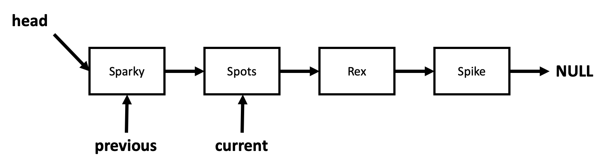

## Step 2: Loop to Change References

Figure out when your changing references loop should end. At each iteration, you should save current's next using another **Node** reference variable, let's say **next**. 

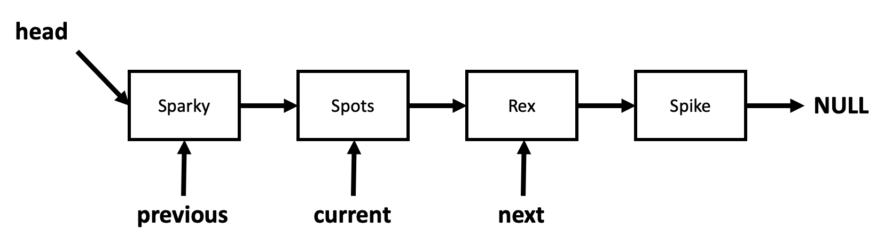

Then, your next step should make **current**'s next point to **previous**. 

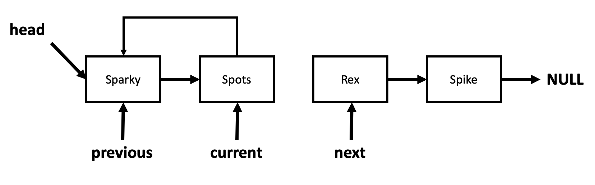

Then, assign **current** to **previous** and **next** to current, setting the stage for next loop iteration.

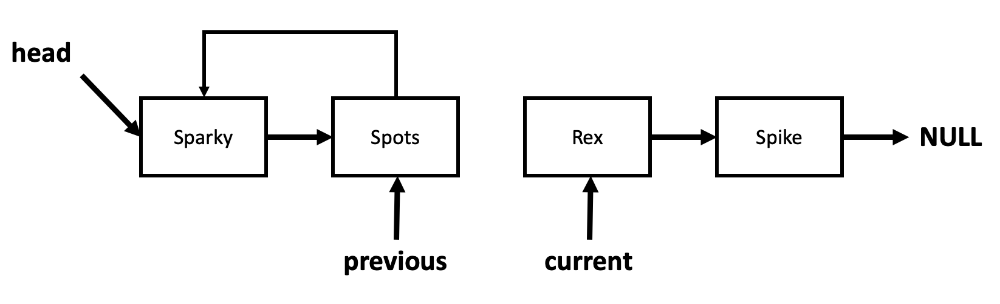

Let's run one more iteration. First set **current**'s next to reference variable **next**. 

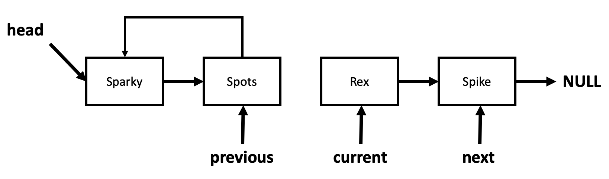

Then, your next step should make **current**'s next point to **previous**. 

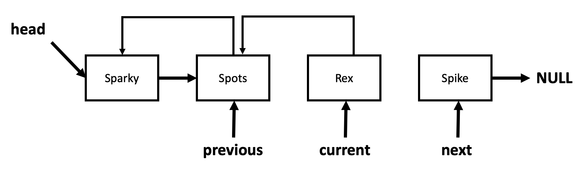

Then, assign **current** to **previous** and **next** to current, setting the stage for next loop iteration.

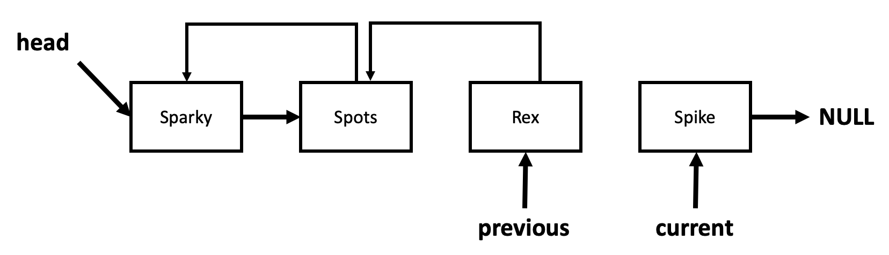

Let's now run what should be the last iteration. First set **current**'s next to reference variable **next**. 

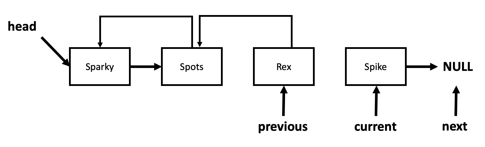

Then, your next step should make **current**'s next point to **previous**. 

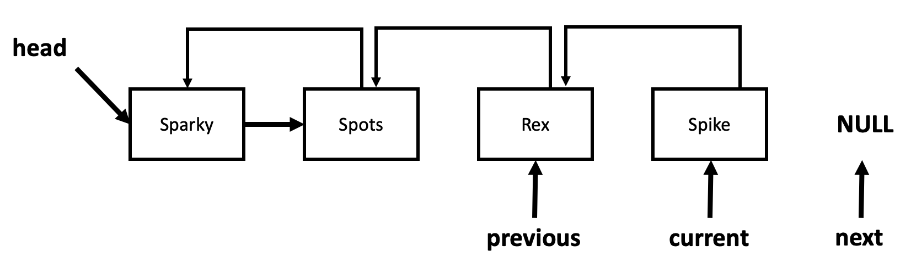

Then, assign **current** to **previous** and **next** to current, setting the stage for next loop iteration, which won't happen because **current** is null. 

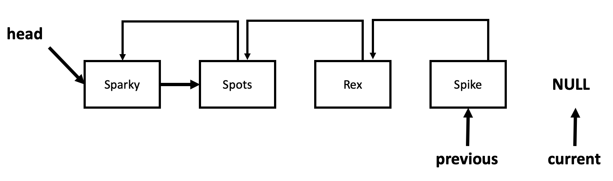

## Step 3: Update the "head" Node

After your loop is done, you still need to update the **head** node using **previous**. The final configuration is illustrated below. Well, not quite final yet... Note the never ending loop between **spots** and **sparky**. 

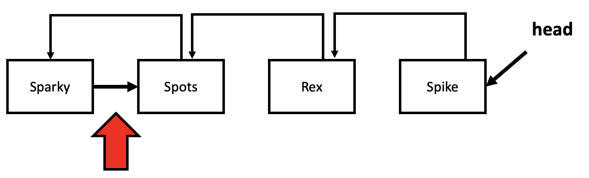

Removing that reference is left for you to figure out. 

## Improving the Solution

Now that you have one solution that works, try to improve it by initializing **previous** to null and **current** to head. See if you can write the loop that changes the references in a way that works for all cases and that also updates head as the reverse list is built. 

# Submission

Zip **LinkedList.java** and **LinkedListDriver.java** into **hwk_04.zip** and upload the file to Canvas. 

```
hwk_04.zip
|__LinkedList.java
|__LinkedListDriver.java
```

# Grading

```
+3 for the algorithm that reverses the linked list (TODO #1)
+2 for the use of reverse in LinkedListDriver (TODO #2)
-1 if you were not able to remove the reference loop described above
```