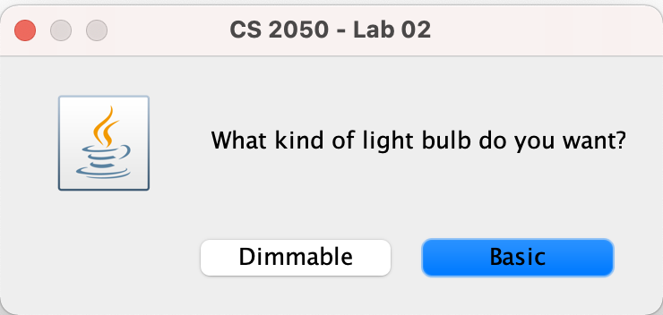
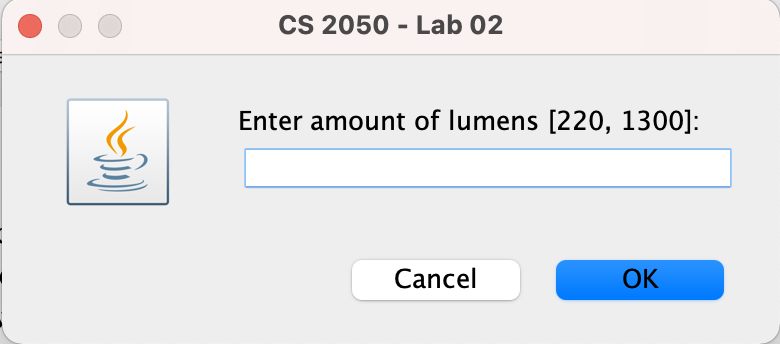
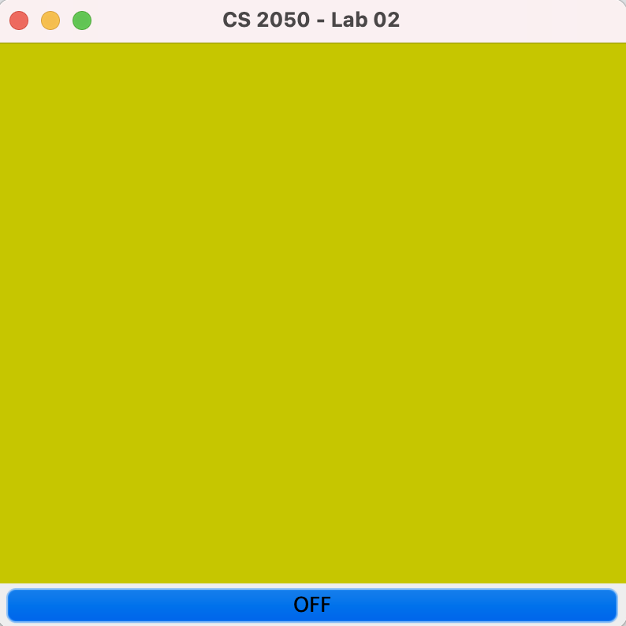
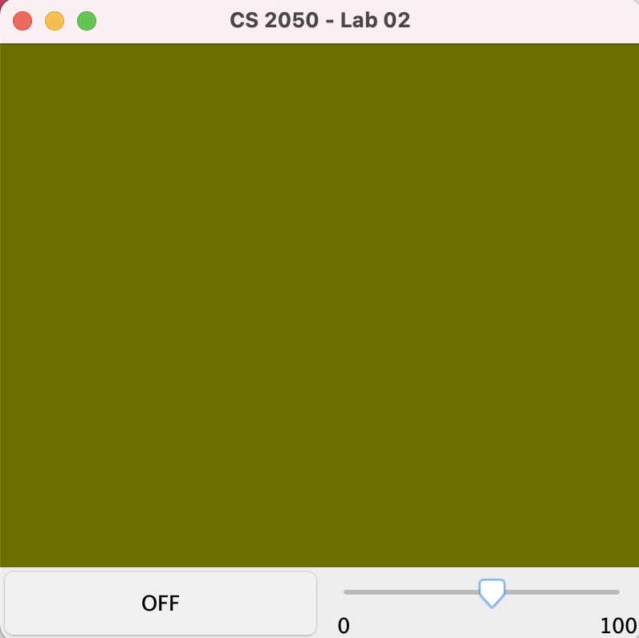

# Introduction

In this lab you are asked to create two classes. The first one is called **LightBulb** and models a light bulb with a brightness in lumens (an integer value). A LightBulb object can be turned ON and OFF. The second class is called **DimmableLightBulb** and it should be specialized from **LightBulb** with an added feature: a dimmer to control the percentage of lumens emitted by the light. Complete the lab by finishing an application that allows interaction with a light bulb. 

# The LightBulb Class

Define a constructor that accepts the amount of lumens. If the informed value is smaller/greater than the minimum/maximum accepted value, have it default to the minimum/maximum accepted value, respectively. A light bulb should always be created in the OFF state. Add basic getter/setter methods like: isOn, turnOn, turnOff, and getLumens. 

# The DimmableLightBulb Class

As mentioned previously, the **DimmableLightBulb** class should be a specialization from **LightBulb** with an extra feature: an integer from 0 to 100 that defines the dimmer value. Define a constructor in **DimmableLightBulb** that accepts the amount of lumens. Use super to call the parent’s constructor, forwarding the lumens informed value to it. Set the initial value for the dimmer to its maximum possible value. Add basic getter/setter methods like: getDimmer and setDimmer. Make sure setDimmer prevents the user to set a dimmer value that is invalid. 

# The RoomFrame Class

The RoomFrame class allows users to pick which type of light bulb to be created: the basic one or the dimmable one. Users also have the ability to choose the value for the amount of lumens. 

The GUI is implemented for you and it has an ON and OFF switch to control the light.  If the chosen light is dimmable, the GUI will also display a slider for the dimmer. The figure below shows the GUI for the two types of light. Follow the to do’s embedded in the code to complete the lab. Hint: use the instanceof operator to determine if an object is of a particular type: **LightBulb** or **DimmableLightBulb**.

The actual lumens of a dimmable light bulb is adjusted based on the dimmer (a percent from 0-100). For example, if the factory's lumen of a dimmable light bulb is 1300 but the dimmer is set to 50, then the actual lumen displayed by the light bulb is adjusted to 50% of 1300 or 650 lumens. 

# Rubric

+1 TODO #1 (LightBulb class)
+1 TODO #2 (DimmableLightBulb class)
+1 TODO #3 (ON/OFF control)
+1 TODO #4 (dimmer control)
+1 TODO #5 (main)