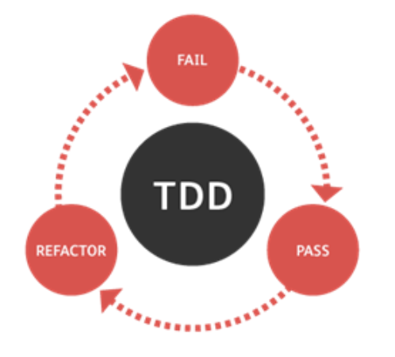

# Introduction

In this activity you will implement a **Fraction** class, which is defined by two integers: the numerator and the denominator. The **Fraction** class has a parameterless constructor that sets both the numerator and denominator to one (**Fraction.DEFAULT_VALUE**). The Fraction class also defines two parameterized constructors: 

* one that accepts a value for the numerator, setting the denominator to one (**Fraction.DEFAULT_VALUE**);
* and another one that allows the user to set both the numerator and denominator; however, if the informed denominator is zero, this constructor should set it to one instead (**Fraction.DEFAULT_VALUE**). 

The **Fraction** class also defines “getter” and “setter” methods. The **setDenominator** method should forbid the user from changing the Fraction’s denominator to zero. Do not throw an exception if the denominator is set to zero. Instead, just "do nothing."

Other methods defined in the **Fraction** class are: 

* **getValue** returns the value of the fraction (as a floating-point value); in other words, this method returns the results of dividing its numerator by its denominator;
* **isNegative** returns true if the value of the fraction is less than zero; false otherwise;
* **gcd** is a helper method that returns the “Greatest Common Divisor” of the numerator and the denominator of the fraction object;
* **simplify** divides the fraction’s numerator and denominator by the gcd of the numbers; also, if the numerator is positive and the denominator is negative, this method switch signs between them; finally, if the numerator and the denominator are both negatives, this method cancels their signs, making them both positive;
* **isProper** returns true if the function is proper; false otherwise; a fraction is considered proper if the absolute value of its numerator is smaller than the absolute value of its denominator.

# Unit Testing

There is a set of unit test cases for the **Fraction** class. All tests are defined in the class named **FractionTest**. As discussed in class, TDD (or Test-Driven Development) encourages the development team to write all tests for a class before its actual implementation.  Advocates of TDD believe that this approach leads to a more focused coding because it gives a specific goal to the developer, which is to PASS all tests. However, in order for TDD to be effective, the tests must be thorough. In other words, a good set of tests is one that captures and verifies all possible uses of your class.  

# Submission

Zip **Fraction.java** and **FractionTest.java** in a file named **fraction.zip** (this is the file that you need to upload on Canvas). 

# Rubric

+2 Fraction class 

+3 FractionTest class

**BONUS POINTS**

+1 **toString** override in **Fraction** using the format "N/D", replacing N by the numerator and D by the denominator. 

+1 **doc** folder with the JavaDoc with the Fraction class documentation. 

