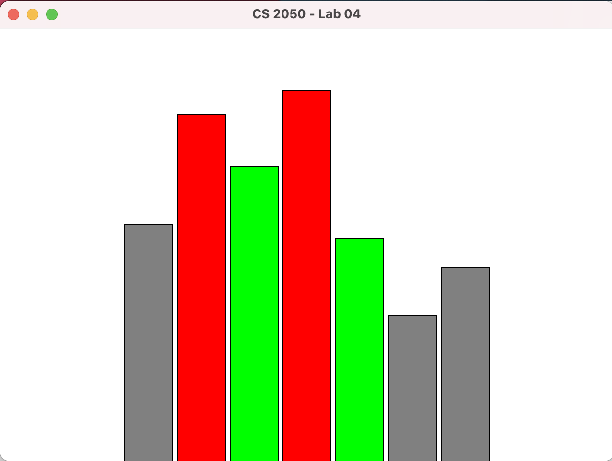

# Introduction

Circular linked lists are special types of linked lists where the last element (the tail node) points back to the first node (the head node).  One application of circular lists is in task schedulers. Imagine a multitasking operating system (OS). Each task has a size (an estimate of how long it will take to run it) and a priority: 1 for low (gray), 2 for standard (green), and 3 for high (red). The OS iterates over its circular list of tasks, given each task a slice of its processing time. Low priority tasks will be given just one slice of time, while standard tasks will be given 2 slices of time, and finally, high priority tasks will be given 3 slices of time. The goal of this assignment is to have you finish the implementation of a circular list and use it to simulate an OS scheduler running tasks with different priorities. 


Different priority tasks running

# The Task Class 

A task has size > 0 and a priority (1, 2, or 3). Tasks can be dead or alive. Tasks are always created in the "alive" state. A task can be run for a slice of time. The effect of running a task is that its size is decremented by 1 unit. If after running a task size becomes zero, then its status is set to "dead". 

# The Circular Linked List Class 

Just like a standard linked list, a circular list is defined using a head node.  However, the tail node of a circular linked list always points to the head node.  This makes it easier to iterate indefinitely over a circular linked list, which makes perfect sense for its used in a task scheduler. 

# The Task Scheduler Class

Most of the code for this class is given to you.  The only part left is the "run" method, which should use the circular linked list iterator. While iterating over the tasks, check if the task is dead first. If that's the case, just ignore the task and move to the next one in the list.  If the task is alive, run it a number of times based on its priority (1x for low, 2x for standard, and 3x for high). For a better visual effect, have the code sleep for 250ms and then call repaint every time a task runs. The snippet below shows how to have your code sleeps for 250ms. 

```
try {
    Thread.sleep(250);
}
catch (Exception ex) {
}
```

# Submission

Zip Task.java, CircularLinkedList.java, and TaskScheduler.java into a file named lab_04.zip.  Then upload lab_04.zip to Canvas. 

# Rubric

+2 Task class

+2 CircularLinkedList class

+1 TaskScheduler class

