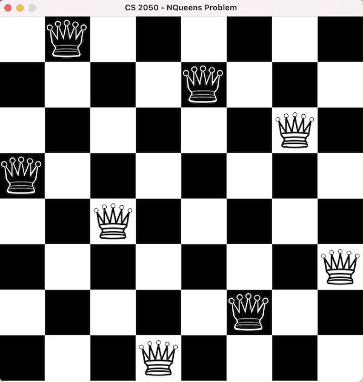

# Introduction

The N-Queens problem can be stated as: **can you place n queens on a nxn board in such a way that no one attacks another queen?** The problem is credited to Max Bezzel who first formulated the problem in 1848. N-Queens can be solved using a computational technique called **exhaustive search** which tests all possible solutions to a problem. In this project, you are asked to solve the N-Queens problem using **exhaustive search** optimized with **tree pruning** and **backtracking**. In summary, you will develop a program that will display all solutions for the N-Queens problem, given the value for **n**, also showing how many solutions were found at the end. The figure below shows one solution for a 8-Queens instance of the problem. 



# The ChessBoard Class

The ChessBoard class models a chess board with a given size (parameter N of the problem), which should be in [4, 15]. If the size is not informed, its value defaults to 8. The actual board configuration is controlled using a 2D array of boolean. In this project we will use the convention: 1st dimension represents rows and 2nd dimension represents columns. Placing a queen at location means setting the board's location to **true**. ChessBoard defines methods that are helpful to modify or verify the state of the chess board. They are described below (also in comments embedded in the code): 

* size(): the size of the chess board (parameter N of the problem);
* setQueen(int i, int j): set a queen at location (i, j);
* hasQueen(int i, int j): checks if there is a queen at location (i, j);
* hasQueen(int i): checks if there is a queen at row i;
* isValid(): checks if the current configuration is valid (no queens attacking);
* isSolved(): checks if the current configuration is valid and it solves the problem (number of queens placed matches the problem's size); 
* queens(): the number of queens currently on the board; 
* clone(): returns a new ChessBoard that has the exact same configuration of the current one. 

You are NOT allowed to change any of the ChessBoard's interface (methods above). Your solution must use all methods above. However, you are free to add your own (private) methods as you find them useful. Two helper methods are suggested: 

* checkDiagonals(): checks if the current configuration passes the diagonals test (no queens attacking on diagonals); 
* checkRowsColumns(): checks if the current configuration passes the row/column test (no queens attacking on rows/columns).

# The ChessBoardTest Class

SOME unit tests were provided. However, those tests are far from being comprehensive as they only do basic checks of the ChessBoard class. It is up to you to create your own tests to certify whether your class is ready to be used in NQueens. Feel free to share your ChessBoardTest class with your classmates. I will try to create more tests and share with you later. 

# The ChessPanel Class 

This class implements the GUI for the board. The code is given to you. The only method that you should understand is the following: 

* updateChessBoard(ChessBoard chessBoard): updates the chess board as seen by the GUI.

# The NQueens Class 

The NQueens class is the application that solves the N-Queens problem. It starts by asking the user for the parameter **N**.  Then it instantiates a **NQueens** object with the given **size** and calls its **run** method, which implements the **exhaustive search** algorithm to solve the problem, showing each chess board configuration on the GUI, pausing **SLEEP_TIME**ms between configurations and returning the total number of chess board configurations found. 

The **exhaustive search** algorithm was explained in class. But basically you need to create a stack of **ChessBoard** objects and then push **size** **ChessBoard** objects, each of then placing a queen at a different column (or row, depending on your approach). At each iteration of the **exhaustive search** main loop, pop one **ChessBoard** object from the stack and check if it's solved.  If that is the case, update the **ChessPanel** using **updateChessBoard** and then call **repaint**. Give a **SLEEP_TIME**ms pause for the user to be able to see the (new) configuration. Remember to count this new solution. 

If the **ChessBoard** object popped out from the stack is NOT solved, then try to place a new queen on different columns on the next row (or different rows on the next column, depending on your approach). Before pushing each new configuration onto the stack, make sure that this new configuration is still valid. Because if the board is already invalid, there is NO point in continuing this path. This is the **pruning** part of the algorithm. 

**CAREFUL HERE**: while creating new configurations, do not change and use the current configuration object. Instead, CLONE it first and then make changes on the cloned object. Otherwise, you will be making changes on the same configuration and pushing the same object onto the stack.  

When the stack becomes empty it means that all solutions were found. Return the number of solutions found. 

# Submission

To **avoid** having points deducted, you MUST submit your project using the right format, which is: a zip file named "prg_02.zip" with the following files ONLY:

```
ChessBoard.java
NQueens.java
```

Those files should NOT be in a subfolder. This is the structure that I am expecting:

```
prg_02.zip
|___ChessBoard.java
|___NQueens.java
```

Make sure to write your name in all source files submitted. Use the provided comment sections.

# Rubric 

```
+65 ChessBoard 
    +7 constructors
    +3 size
    +5 setQueen 
    +5 hasQueen at location 
    +5 hasQueen at row
    +20 isValid 
    +5 queens
    +5 isSolved
    +10 clone
+35 NQueens
    +10 stack initialization 
    +5 exhaustive search main loop structure
    +10 exhaustive search implementation w/ prunning and backtracking
    +5 GUI update
    +5 solutions count
-5 file submitted does not follow the format asked
-5 comment sections of the source files do not list the name(s) of the student(s)
```